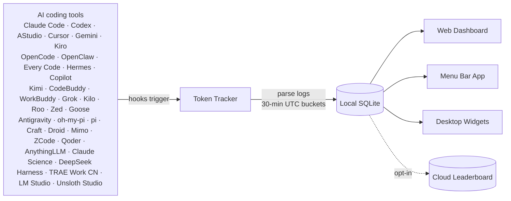

 <div align="center">

# Token Tracker

[English](./README.md) · [简体中文](./README.zh-CN.md) · [日本語](./README.ja.md) · **한국어** · [Deutsch](./README.de.md)

### 모든 CLI에서 AI에 쓰는 비용을 정확히 파악

**37개의 AI 코딩 도구**에서 토큰 수치를 자동으로 수집하고 로컬에서 집계해, 실제 비용 추세를 아름다운 대시보드에서 확인. 클라우드 계정 불필요, API Key 불필요, 셋업 불필요 — 명령 한 줄이면 끝.

[](https://www.npmjs.com/package/tokentracker-cli)
[](https://www.npmjs.com/package/tokentracker-cli)
[](https://github.com/xiufengsun/homebrew-tokentracker)
[](https://opensource.org/licenses/MIT)
[](https://www.apple.com/macos/)
[](https://github.com/xiufengsun/TokenTracker/stargazers)
[](https://github.com/ruanyf/weekly/blob/master/docs/issue-393.md)
[](https://github.com/xiufengsun/TokenTracker)

<br/>

<video src="https://github.com/user-attachments/assets/5e709422-5af8-4e4c-8109-f5bb711eb3f8" controls muted playsinline poster="https://raw.githubusercontent.com/xiufengsun/tokentracker/main/docs/screenshots/dashboard-dark.png" width="820">
  
</video>

<video src="https://github.com/user-attachments/assets/3275979d-bbed-4639-83e2-8b7d83bed6af" controls muted playsinline poster="https://raw.githubusercontent.com/xiufengsun/tokentracker/main/docs/screenshots/dashboard-light.png" width="820"></video>

<br/><br/>

⭐ **TokenTracker가 시간을 아껴줬다면 [GitHub에서 스타를 눌러주세요](https://github.com/xiufengsun/TokenTracker) — 다른 개발자들이 이 프로젝트를 발견하는 데 도움이 됩니다.**

<br/>

[](https://ko-fi.com/M4M11XSNWD)

</div>

---

## ⚡ 빠른 시작

> **요구 사항**: Node.js **20+** (CLI는 macOS / Linux / Windows에서 동작; 네이티브 데스크톱 앱은 macOS(메뉴바), Windows(시스템 트레이), Linux(AppImage, 트레이) 제공. Cursor 토큰 읽기는 가능한 경우 시스템 `sqlite3` CLI를 사용하고, 지원되는 Node 릴리스에서는 `node:sqlite`로 폴백).

```bash
npx tokentracker-cli
```

끝입니다. 첫 실행에서 hook을 설치하고, 데이터를 동기화한 뒤 `http://localhost:7680`에 대시보드를 엽니다.

**30초 안에 얻는 것:**
- 📊 사용 추세, 모델별 분석, 비용 분석을 보여주는 `localhost:7680`의 로컬 대시보드
- 🔌 설치된 모든 지원 AI 도구에 대한 hook 자동 감지
- 🏠 100% 로컬 — 계정 없음, API Key 없음, 네트워크 호출 없음 (옵션 리더보드 제외)
- 🧩 *옵션:* 250+개의 공개 Skill을 둘러보고 Claude · Codex · AStudio · Gemini · OpenCode · Hermes 간에 동기화할 수 있는 Skills 탭

> **네이티브 데스크톱 앱이 필요하다면?**
> - **macOS** — [`TokenTrackerBar.dmg` 다운로드](https://github.com/xiufengsun/TokenTracker/releases/latest/download/TokenTrackerBar.dmg) → Applications로 드래그. 데스크톱 위젯, 메뉴바 상태 아이콘, WKWebView 안의 동일한 대시보드를 포함합니다.
> - **Windows** — [`TokenTracker-Setup.exe` 다운로드](https://github.com/xiufengsun/TokenTracker/releases/latest/download/TokenTracker-Setup.exe) → 관리자 권한이 필요 없는 사용자 단위 설치 프로그램 실행. WebView2 안에 대시보드를 표시하는 시스템 트레이 앱입니다. 포터블 zip은 [릴리스 페이지](https://github.com/xiufengsun/TokenTracker/releases/latest)에 있습니다.
> - **Linux** — [`TokenTracker-linux-x86_64.AppImage` 다운로드](https://github.com/xiufengsun/TokenTracker/releases/latest/download/TokenTracker-linux-x86_64.AppImage) → `chmod +x` 후 실행. WebKitGTK 창에 대시보드를 표시하는 트레이 앱입니다. GTK/WebKit을 함께 담고 있어 비교적 최신 glibc 외에는 배포판 의존성이 없습니다. GNOME에서는 트레이 아이콘에 [AppIndicator 확장](https://extensions.gnome.org/extension/615/appindicator-support/)이 필요합니다. `.deb`, `.rpm` 패키지도 [릴리스 페이지](https://github.com/xiufengsun/TokenTracker/releases/latest)에서 받을 수 있으며, 이쪽은 배포판의 `webkit2gtk-4.1`, `gtk3`, appindicator를 사용합니다. `.deb`는 `libappindicator3-1`을 요구하는데 Debian 12는 이를 빼고 `libayatana-appindicator3-1`을 제공하므로, Debian 12에서는 AppImage를 사용하세요.

짧은 명령어로 쓰려면 전역 설치:

```bash
npm i -g tokentracker-cli

tokentracker              # 대시보드 열기
tokentracker sync         # 수동 동기화
tokentracker status       # hook 상태 확인
tokentracker doctor       # 헬스 체크
```

### 🍺 Homebrew (macOS)

`brew`를 선호한다면, 별도 tap 단계 없이 바로 설치 가능:

```bash
# macOS 메뉴바 앱 (DMG)
brew install --cask xiufengsun/tokentracker/tokentracker

# CLI만
brew install xiufengsun/tokentracker/tokentracker
```

업그레이드는 `brew upgrade --cask xiufengsun/tokentracker/tokentracker`. tap은 새 릴리스마다 한 시간 이내에 자동 갱신됩니다.

---


## ✨ 기능

- 🔌 **37개의 AI 도구 기본 지원** — Claude Code, Codex CLI, AStudio, Cursor, Gemini CLI, Antigravity, Kiro, OpenCode, OpenClaw, Every Code, Hermes Agent, GitHub Copilot, Kimi Code, CodeBuddy, WorkBuddy, Grok Build, oh-my-pi, pi, Dots, Prime Agent, Craft Agents, Reasonix, Kilo CLI, Kilo Code, Roo Code, Zed Agent, Goose, Droid, Mimo Code, ZCode, Qoder, AnythingLLM Desktop, Claude Science, DeepSeek Harness, TRAE Work CN, LM Studio, Unsloth Studio
- 🏠 **100% 로컬** — 토큰 데이터가 기기를 떠나지 않습니다. 계정 없음, API Key 없음.
- 🚀 **제로 설정** — 첫 실행 시 Hook 자동 설치. 0에서 대시보드까지 30초.
- 📊 **아름다운 대시보드** — 사용 추세, 모델별 비용 분석, GitHub 스타일 활동 히트맵, 프로젝트 귀속 정보
- 🖥️ **네이티브 데스크톱 앱** — macOS 메뉴바(위젯 포함)와 Windows 시스템 트레이. 각각 임베디드 서버와 네이티브 WebView 대시보드를 제공합니다
- 🎨 **4종 데스크톱 위젯** — Pin Usage / Activity Heatmap / Top Models / Usage Limits를 데스크톱에 고정
- 📈 **실시간 사용 한도** — Claude / Codex / Cursor / Gemini / Kimi / Kiro / Grok / Copilot / Antigravity / ZCode / OpenCode Go / Qoder / Qoder CN 한도를 표시하고 로컬 provider 앱이 잠시 종료되어도 last-good 캐시 유지
- 🟢 **서비스 상태 페이지** — 8개 공식 provider 상태 페이지의 운영 및 장애 상태 표시
- 💰 **비용 엔진** — [LiteLLM](https://github.com/BerriAI/litellm/blob/main/model_prices_and_context_window.json)을 통해 2,200+개 모델 가격 책정 (매일 자동 갱신) + 틈새 도구 (Kiro, Cursor Composer, Kimi, CodeBuddy hy3)를 위한 수동 큐레이션 오버라이드; 24시간 디스크 캐시 + 번들된 오프라인 스냅샷으로 인터넷 없이도 정확한 USD 표시. 벤더가 공식 가격을 공개하지 않은 모델 (예: Tencent hy3-preview)은 토큰만 추적되며 벤더가 요율을 공개할 때까지 비용은 $0으로 표시됩니다.
- 🌐 **옵션 리더보드** — 전 세계 개발자들과 비교; 컬럼을 드래그하여 관심 있는 프로바이더에 집중 (옵트인, 참여하려면 사인인 필요)
- 🔄 **기기 간 계정 뷰** — 클라우드 동기화를 켜면 작업하는 모든 기기(노트북 + 데스크톱 + 서버)의 사용량을 하나의 뷰로 통합 — 총량·트렌드·히트맵·모델 분석을 모두 기기 통합으로 집계 (옵트인, 사인인 필요; 기본 로컬 전용 경험은 즉시·오프라인 유지)
- 🧩 **옵션 Skills 탭** — `anthropics/skills`, `ComposioHQ/awesome-claude-skills`, `skills.sh` 그리고 직접 추가한 임의의 GitHub 저장소에서 250+개의 공개 Skill을 둘러보고, 타겟 이름을 지정해 Claude / Codex / AStudio / Gemini / OpenCode / Hermes에 동기화. 원클릭 Undo 지원.
- 🔒 **프라이버시 우선** — 토큰 수치와 타임스탬프만. 프롬프트, 응답, 파일 내용은 절대 다루지 않음.

---

## 🖼️ 쇼케이스

<table>
<tr>
<td width="50%">

**대시보드** — 사용 추세, 모델별 분석, 비용 분석


</td>
<td width="50%">

**데스크톱 위젯** — 사용 정보를 데스크톱에 고정


</td>
</tr>
<tr>
<td width="50%">

**메뉴바 앱** — 애니메이션 Clawd 컴패니언 + 네이티브 패널


</td>
<td width="50%">

**글로벌 리더보드** — 전 세계 개발자들과 비교


</td>
</tr>
<tr>
<td colspan="2">

**Skills Manager** — GitHub와 `skills.sh`에서 250+개의 공개 Skill을 둘러보고, 한 번 설치하면 Claude / Codex / AStudio / Gemini / OpenCode / Hermes에 동기화. 타겟별 토글, 원클릭 Undo, 수동 파일 복사 불필요.


</td>
</tr>
<tr>
<td colspan="2">

**데스크톱 펫** — 데스크톱 위에 떠 있는 픽셀 컴패니언. 실제 토큰 사용량에 반응해 코딩할 때 함께 일하고, 연속 기록을 축하하고, 쉴 때는 잠듭니다. [codex-pets.net](https://codex-pets.net) 링크나 `.codex-pet.zip`으로 커뮤니티 펫을 가져올 수 있고, V2 펫은 커서를 16방향으로 따라봅니다. macOS / Windows / 웹 지원.


</td>
</tr>
</table>

---

## 🔌 지원 AI 도구

| 도구 | 감지 | 방식 |
|---|---|---|
| **Claude Code** | ✅ 자동 | `settings.json`의 SessionEnd hook |
| **Codex CLI** | ✅ 자동 | `config.toml`의 TOML notify hook |
| **AStudio** | ✅ 자동 | `config.toml`에 TOML notify hook 작성 |
| **Cursor** | ✅ 자동 | API + SQLite 인증 토큰 |
| **Kiro** | ✅ 자동 | SQLite + JSONL 하이브리드 |
| **Gemini CLI** | ✅ 자동 | SessionEnd hook |
| **OpenCode** | ✅ 자동 | 플러그인 시스템 + SQLite |
| **OpenClaw** | ✅ 자동 | 세션 플러그인 |
| **Every Code** | ✅ 자동 | TOML notify hook |
| **Hermes Agent** | ✅ 자동 | SQLite sessions 테이블 (`~/.hermes/state.db`) |
| **GitHub Copilot App / CLI** | ✅ 자동 | 요청별 통합 SQLite 사용량 (`~/.copilot/session-store.db`), App DB는 레거시 기준선 |
| **GitHub Copilot Chat 확장 / 이전 CLI** | ✅ 자동 | OpenTelemetry 파일 익스포터 (`COPILOT_OTEL_FILE_EXPORTER_PATH`) |
| **Kimi Code** | ✅ 자동 | 패시브 `wire.jsonl` 리더 (`~/.kimi/sessions/**/wire.jsonl`) |
| **oh-my-pi (Pi Coding Agent)** | ✅ 자동 | 패시브 리더 (`~/.omp/agent/sessions/**/*.jsonl`) |
| **CodeBuddy** (Tencent) | ✅ 자동 | `~/.codebuddy/settings.json`의 SessionEnd hook (Claude-Code fork) |
| **WorkBuddy** (Tencent) | ✅ 자동 | `~/.workbuddy/settings.json`의 SessionEnd hook (Claude-Code fork) + 패시브 `projects/**/*.jsonl` 스캔 |
| **Grok Build** (xAI) | ✅ 자동 | SessionEnd hook + 패시브 `updates.jsonl` / `signals.json` 스캔 (`~/.grok/sessions/**/`) |
| **Kilo CLI** (kilo.ai) | ✅ 자동 | 패시브 SQLite 리더 (`~/.local/share/kilo/kilo.db`, OpenCode-fork 스키마) |
| **Kilo Code** (VS Code 확장) | ✅ 자동 | 패시브 `ui_messages.json` 리더 (Cursor/Code/CodeBuddy/Windsurf globalStorage) |
| **Antigravity** | ✅ 자동 | 패시브 트랜스크립트 리더 (`~/.gemini/{antigravity,antigravity-ide,antigravity-cli}/brain/**/transcript.jsonl`) |
| **pi** (`@mariozechner/pi-coding-agent`) | ✅ 자동 | 패시브 리더 (`~/.pi/agent/sessions/**/*.jsonl`) |
| **Dots** | ✅ 자동 | pi의 provider 분리를 통해 라우팅 (`pi-dots` source, 동일한 패시브 리더 재사용) — 별도 hook 없음 |
| **Prime Agent** | ✅ 자동 | 메타데이터 전용 패시브 사용량 리더 (`~/.prime/agent/sessions/*.jsonl`) |
| **Craft Agents** | ✅ 자동 | 패시브 세션 리더 (`~/.craft-agent` + workspace session logs) |
| **Reasonix** | ✅ 자동 | 패시브 텔레메트리 리더 (`~/.reasonix/**/*.jsonl.telemetry.json`) |
| **Roo Code** (VS Code 확장) | ✅ 자동 | 패시브 `ui_messages.json` 리더 (`rooveterinaryinc.roo-cline`) |
| **Zed Agent** | ✅ 자동 | 패시브 SQLite 리더 (`threads.db`, hosted `zed.dev` models only) |
| **Goose** (Block) | ✅ 자동 | 패시브 SQLite 리더 (`sessions.db`, cumulative deltas) |
| **Droid** (Factory) | ✅ 자동 | 패시브 세션 리더 (`~/.factory/sessions/**/settings.json`, cumulative deltas) |
| **Mimo Code** (mimocode) | ✅ 자동 | 패시브 SQLite 리더 (`~/.local/share/mimocode/mimocode.db`, OpenCode-fork schema; mimo 네이티브 턴만 집계 — 미러링된 Claude/claude-mem 기록은 제외) |
| **ZCode** (Z.ai) | ✅ 자동 | 패시브 SQLite 리더 (`~/.zcode/cli/db/db.sqlite`, OpenCode-fork schema; Z.ai/BigModel GLM 턴만 집계 — 번들된 Claude/Codex/Gemini 서브에이전트는 제외) |
| **Qoder** | ✅ 자동 | 패시브 SQLite 리더 (`Qoder/SharedClientCache/cache/db/local.db`; assistant `token_info`만 읽고 캐시 입력을 분리하며 prompt/response는 읽지 않음) 및 Qoder 로컬 세션의 Plan Credits / Ultimate 무료 호출 한도 |
| **LM Studio** | ✅ 자동 | `~/.lmstudio/server-logs/**/*.log` 패시브 재귀 리더. Chat Completions / Responses API 최종 응답에서 ID, 모델, 시각, 스칼라 `usage` 카운터만 읽고 응답 ID로 중복 제거합니다. prompt/response 본문은 보관하지 않습니다. 이 데이터는 로컬 추론과 LM Link(API 한계 비용 $0)를 포함하며 Bionic Secure Cloud 청구는 포함하지 않습니다. |
| **Unsloth Studio** | ✅ 자동 | `$UNSLOTH_STUDIO_HOME/studio.db`(기본값 `~/.unsloth/studio/studio.db`) 패시브 SQLite 리더. 스칼라 `contextUsage`와 내용이 없는 `api_usage_events`만 읽으며 prompt, reply, 첨부, API subject, 자격 증명, 학습 지표는 제외합니다. 로컬 경로는 $0, 알려진 유료 provider 경로는 실제 응답 모델로 token 비용을 추정합니다. |
| **AnythingLLM Desktop** | ✅ 자동 | 패시브 SQLite 리더 (`anythingllm-desktop/storage/anythingllm.db`, 메시지별 token 지표만 읽음) |
| **Claude Science** | ✅ 자동 | 패시브 SQLite 리더 (`~/.claude-science/operon-cli.db`, `frames` 테이블의 token 카운터만 읽으며 prompt·산출물·연구 내용은 읽지 않음). 네이티브 Windows 빌드가 없어 Windows에서는 WSL 안에서 실행되는 앱을 읽습니다. |
| **DeepSeek Harness** | ✅ 자동 | 패시브 세션 리더 (`~/.dsh/sessions/**/session.jsonl[.zstd]`, 세션 헤더와 assistant 이벤트를 파싱하고 멀티 프레임 zstd 압축 해제를 지원) |
| **TRAE Work CN** | ✅ 자동 | **명시적인 옵트인이 필요합니다: `TOKENTRACKER_TRAE_CN_USAGE=1` 을 설정하세요.** 사용량을 읽으면 로컬에 저장된 로그인 인증이 TRAE의 내부 API로 전송되므로, 켜기 전에는 아무것도 전송되지 않습니다. 켠 뒤에는: 로컬 TRAE Work CN 인증이 있을 때 실행 가능한 비백그라운드 동기화 중에 macOS의 로그인된 앱에서 session-token 사용량을 읽습니다. 내부 API는 변경될 수 있습니다 |

> **플러그인이나 hook을 수동으로 설치해야 하나요?** 아니요. `tokentracker` (또는 `tokentracker init`)가 첫 실행에서 모든 것을 처리합니다:
> - **Hook 기반** 도구 (Claude Code, Codex, AStudio, Gemini, Every Code, **CodeBuddy**, **WorkBuddy**, **Grok Build**) — 도구 자체의 설정에 SessionEnd hook 또는 TOML notify 엔트리를 작성합니다.
> - **플러그인 기반** 도구 (OpenCode, **OpenClaw**) — 플러그인은 npm 패키지 안에 포함되어 있습니다. OpenClaw 세션 플러그인은 `~/.tokentracker/tracker/openclaw-plugin/openclaw-session-sync/`에 있으며, OpenClaw 자체 CLI로 링크하고 활성화한 뒤 동기화를 트리거하는 세션 종료 이벤트를 허용하도록 `hooks.allowConversationAccess=true`를 설정합니다. 다운로드, 드래그 앤 드롭 불필요.
> - **패시브 리더** (Cursor, Kiro, Hermes, Kimi Code, Copilot, **Grok Build**, **oh-my-pi**, **pi**, **Craft Agents**, **Reasonix**, **Kilo CLI**, **Kilo Code**, **Roo Code**, **Antigravity**, **Zed Agent**, **Goose**, **Droid**, **Mimo Code**, **ZCode**, **LM Studio**, **Unsloth Studio**, **AnythingLLM Desktop**, **Claude Science**, **DeepSeek Harness**) — 이들 도구에는 아무것도 설치하지 않습니다. 도구가 이미 생성하는 파일 (SQLite DB, JSONL, OTEL export, session logs)만 읽습니다. Copilot App / CLI 사용량은 `~/.copilot/session-store.db`에서 요청별로 읽습니다. `data.db`는 레거시 마이그레이션 기준선으로 한 번만 사용하며 store가 정식 소스가 된 뒤에는 관찰 전용으로 유지됩니다. Chat 확장과 이전 CLI는 계속 OTEL을 사용하며, TokenTracker가 겹치는 요청을 한 번만 집계합니다. 마이그레이션 전 혼합 App/CLI 기록에서 모델을 안전하게 분리할 수 없는 잔여분은 추정 모델 대신 `github-copilot-legacy` 집계로 보존합니다.
> - **Grok Build 추정** — 현재 로컬 텔레메트리는 `updates.jsonl`의 누적 `totalTokens`를 노출하지만, 안정적인 프롬프트/출력/캐시 분할은 제공하지 않습니다; `signals.json`은 `contextTokensUsed` 스냅샷을 사용한 폴백으로 남아 있습니다. 호출별 사용 상세 정보가 제공될 때까지 TokenTracker는 Grok 비용을 추정합니다.
>
> 언제든 `tokentracker status`로 각 통합의 상태를 확인할 수 있습니다. `skipped`로 표시되면 `detail` 컬럼이 이유를 설명합니다 (예: 도구 CLI가 `PATH`에 없음, 설정 읽기 불가).
>
> 더 깊이 살펴보기: [OpenClaw 통합 & 트러블슈팅](docs/openclaw-integration.md).

원하는 도구가 빠져 있나요? [Issue를 열어주세요](https://github.com/xiufengsun/TokenTracker/issues/new) — 새 프로바이더 추가는 보통 파서 파일 하나 정도면 됩니다.

---

## 🆚 왜 TokenTracker인가?

|                          | **TokenTracker** | ccusage     | Cursor stats |
|--------------------------|:---:|:---:|:---:|
| **지원하는 AI 도구 수**   | **37**           | 1 (Claude)  | 1 (Cursor)   |
| **로컬 우선, 계정 불필요** | ✅            | ✅           | ❌            |
| **네이티브 데스크톱 앱** | ✅ macOS + Windows | ❌          | ❌            |
| **데스크톱 위젯**        | ✅ 4종            | ❌           | ❌            |
| **레이트 제한 추적**     | ✅ 13개 프로바이더 | ❌           | Cursor 전용  |

---

## 🏗️ 작동 방식



1. AI CLI 도구가 평소 사용 중에 로그를 생성
2. 경량 hook이 변경을 감지하고 동기화를 트리거 (Cursor는 hook 대신 API 사용)
3. 토큰 수치는 로컬에서 파싱 — 프롬프트나 응답 내용은 절대 다루지 않음
4. 30분 UTC 버킷으로 집계
5. 대시보드, 메뉴바 앱, 위젯 모두 동일한 로컬 스냅샷을 읽음

---

## 🛡️ 프라이버시

> 📄 **[전체 개인정보 처리방침](docs/PRIVACY.md)**(영문) — 앱이 보낼 수 있는 모든 네트워크 요청, 각 요청이 전송하는 내용, 끄는 방법을 모두 정리했습니다.

| 보호 | 설명 |
|---|---|
| **콘텐츠 업로드 없음** | 토큰 수치와 타임스탬프만. 프롬프트, 응답, 파일 내용은 절대 다루지 않습니다. |
| **기본적으로 로컬 전용** | 모든 데이터는 기기에 머뭅니다. 리더보드는 완전히 옵트인. |
| **감사 가능** | 오픈 소스. [`src/lib/rollout.js`](src/lib/rollout.js)를 읽어보세요 — 숫자와 타임스탬프뿐입니다. |
| **익명 사용 통계만** | 외부 전송은 익명 2가지뿐: (1) 하루 최대 1회 하트비트——머신 ID의 단방향 해시, 앱 버전, OS 플랫폼, 실행 형태(cli/macos/windows/linux); (2) 익명 대시보드 페이지/기능 이벤트(PostHog——autocapture와 세션 녹화 비활성화, 브라우저 Do-Not-Track 존중). 토큰 수, 모델명, 프롬프트, 경로는 절대 포함되지 않습니다. [`src/lib/telemetry.js`](src/lib/telemetry.js)와 [`dashboard/src/lib/analytics.js`](dashboard/src/lib/analytics.js)에서 감사 가능하며 `TOKENTRACKER_NO_TELEMETRY=1` 또는 `DO_NOT_TRACK=1` 하나로 둘 다 비활성화됩니다. |

---

## 📦 설정

대부분의 사용자는 건드릴 필요가 없습니다 — 기본값이 합리적입니다. 고급 설정이 필요할 때:

| 변수 | 설명 | 기본값 |
|---|---|---|
| `TOKENTRACKER_DEBUG` | 디버그 출력 활성화 (`1`로 활성화) | — |
| `TOKENTRACKER_NO_TELEMETRY` | 모든 익명 텔레메트리(일일 하트비트 + 대시보드 분석) 비활성화 (`1`로 비활성화, `DO_NOT_TRACK` 표준도 지원) | — |
| `TOKENTRACKER_HTTP_TIMEOUT_MS` | HTTP 타임아웃 (밀리초) | `20000` |
| `TOKENTRACKER_DISABLE_GIT_ATTRIBUTION` | Git 커밋 연결 비활성화(`1`이면 비활성화). 연결 기능은 각 세션의 작업 디렉터리에서 `git log`를 실행합니다. 비활성화하면 TokenTracker가 프로젝트 디렉터리에 전혀 접근하지 않습니다(Outcomes에는 수동 기록만 표시) | — |
| `TOKENTRACKER_GIT_ATTRIBUTION_PROTECTED_DIRS` | Git 연결이 macOS 보호 위치에 접근하도록 허용(`1`이면 허용). 기본적으로 `~/Documents`, `~/Downloads`, `~/Desktop`, `~/Library`, 미디어 폴더, `/Volumes` 아래의 세션은 건너뜁니다. macOS가 위치마다 별도의 접근 허용 대화상자를 띄우기 때문입니다. 해당 위치에 저장소를 두고 있고 권한을 허용해도 괜찮을 때만 켜세요 | — |
| `CODEX_HOME` | Codex CLI 디렉토리 오버라이드 | `~/.codex` |
| `TOKENTRACKER_ACODE_HOME` | AStudio 디렉토리 오버라이드 | `~/.acode` |
| `GEMINI_HOME` | Gemini CLI 디렉토리 오버라이드 | `~/.gemini` |

---

## 🛠️ 개발

```bash
git clone https://github.com/xiufengsun/TokenTracker.git
cd TokenTracker
npm install

# 대시보드 빌드 + CLI 실행
cd dashboard && npm install && npm run build && cd ..
node bin/tracker.js

# 테스트
npm test
```

### macOS 앱 빌드

```bash
cd TokenTrackerBar
npm run dashboard:build              # 대시보드 번들 빌드
./scripts/bundle-node.sh             # Node.js + tokentracker 소스 번들링
xcodegen generate                    # Xcode 프로젝트 생성
ruby scripts/patch-pbxproj-icon.rb   # Icon Composer 에셋 패치
xcodebuild -scheme TokenTrackerBar -configuration Release clean build
./scripts/create-dmg.sh              # .app을 DMG로 패키징
```

**Xcode 16+** 와 [XcodeGen](https://github.com/yonaskolb/XcodeGen)이 필요합니다.

---

## 🔧 트러블슈팅

### CLI

<details>
<summary><b>"engines.node" 또는 미지원 버전 에러</b></summary>

<br/>

TokenTracker는 **Node 20+** 이 필요합니다. 버전 확인:

```bash
node --version
```

낮다면 [nvm](https://github.com/nvm-sh/nvm), [fnm](https://github.com/Schniz/fnm) 또는 패키지 매니저 (`brew upgrade node`, `apt install nodejs`)로 업그레이드.

</details>

<details>
<summary><b>포트 7680이 이미 사용 중</b></summary>

<br/>

대시보드 서버는 `7680`이 사용 중이면 다음 빈 포트 (`7681`, `7682`, …)를 자동으로 선택합니다. 실제 사용 중인 포트는 시작 시 로그에 출력됩니다. 특정 포트를 강제하려면:

```bash
PORT=7700 tokentracker serve
```

`7680`을 점유 중인 프로세스를 찾으려면:

```bash
lsof -i :7680
```

**WSL2 참고**: Windows 호스트에서는 전송 최적화 서비스(`DoSvc`)가 `7680`을 수신 대기하며, NAT 네트워킹에서는 이 충돌을 WSL 내부에서 감지할 수 없습니다 — 서버는 정상적으로 시작되지만 Windows 브라우저는 `DoSvc`에 연결됩니다. 따라서 TokenTracker는 WSL에서 기본적으로 `7681`을 사용합니다(시작 시 로그에 표시).

</details>

<details>
<summary><b>프로바이더가 감지되지 않음</b></summary>

<br/>

통합 상태 확인:

```bash
tokentracker status
```

이후 doctor로 더 깊은 헬스 체크:

```bash
tokentracker doctor
```

사용하고 있는데도 설정되지 않은 것으로 표시되는 프로바이더가 있다면 `tokentracker activate-if-needed`로 hook 감지를 다시 실행해 보세요. 여전히 없으면 `doctor` 출력을 첨부해 [Issue를 열어주세요](https://github.com/xiufengsun/TokenTracker/issues/new).

</details>

<details>
<summary><b>hook을 제거하고 모든 설정을 삭제하는 방법</b></summary>

<br/>

```bash
tokentracker uninstall
```

이 명령은 감지된 모든 AI 도구에 TokenTracker가 설치한 hook을 모두 제거하고, 로컬 설정과 데이터까지 삭제합니다. 다시 실행해도 안전.

</details>

### macOS 앱

<details>
<summary><b>"TokenTrackerBar을(를) 열 수 없습니다" — 확인되지 않은 개발자</b></summary>

<br/>

TokenTrackerBar는 **애드혹 서명**되어 있습니다 (Apple Developer ID로 공증되지 않음 — 그것은 유료 개발자 계정이 필요합니다). Gatekeeper가 첫 실행을 차단합니다.

1. **시스템 설정 → 개인 정보 보호 및 보안** 열기
2. **보안** 섹션으로 스크롤 — *"TokenTrackerBar이(가) Mac을 보호하기 위해 차단되었습니다."* 가 보입니다
3. **무시하고 열기** 클릭
4. 후속 다이얼로그에서 **열기** 로 확인 (인증 필요)

한 번만 하면 됩니다. 구버전 macOS 대안: Finder에서 앱 오른쪽 클릭 → **열기** → 확인 다이얼로그에서 **열기**.

</details>

<details>
<summary><b>"TokenTrackerBar이(가) 손상되어 열 수 없습니다"</b></summary>

<br/>

이것은 macOS가 다운로드된 모든 파일에 붙이는 `com.apple.quarantine` 속성에 Gatekeeper가 반응하는 것일 뿐 — 실제 문제는 아닙니다. 다음으로 한 번 클리어:

```bash
xattr -cr /Applications/TokenTracker.app
```

이후 앱이 정상적으로 열립니다.

</details>

<details>
<summary><b>"TokenTrackerBar이(가) 다른 앱의 데이터에 접근하려고 합니다"</b></summary>

<br/>

이것은 **Cursor** 와 **Kiro** 통합에 필요합니다. 이들은 인증 토큰 / 사용 데이터를 자신의 `~/Library/Application Support/` 폴더에 저장하는데, macOS는 이를 App Management 권한으로 보호합니다.

- ✅ Cursor 또는 Kiro를 쓴다면 **허용** 클릭
- ❌ 쓰지 않는다면 **허용 안 함** 클릭 — 해당 프로바이더는 조용히 건너뛰고, 나머지는 그대로 작동합니다

한 번 허용하면 권한이 기억됩니다. 애드혹 서명된 빌드는 빌드마다 서명 ID가 새로 생기므로 업그레이드 후 다시 프롬프트가 뜬다는 점에 유의하세요.

</details>

---

## 🪪 README 배지

GitHub 프로필이나 프로젝트 README에서 토큰 사용량을 자랑해 보세요.

`YOUR_USER_ID`를 얻는 방법:
1. `tokentracker`를 실행해 대시보드를 열고 리더보드에 사인인합니다.
2. **Settings → Account**로 이동합니다.
3. 표시되는 **User ID**를 사용합니다. headless / SSH 환경에서는 `tokentracker device-login`도 같은 `user_id`를 `~/.tokentracker/tracker/config.json`에 씁니다.

아래 중 하나를 붙여넣으세요:

```markdown
[](https://github.com/xiufengsun/TokenTracker)
[](https://github.com/xiufengsun/TokenTracker)
[](https://github.com/xiufengsun/TokenTracker)
```

> 링크 대상은 기본적으로 TokenTracker 리포지토리로 설정되어 있어, 클릭 한 번이 다른 개발자의 발견으로 이어집니다. 본인의 leaderboard 프로필, 개인 사이트, 또는 `https://www.tokentracker.cc`로 보내고 싶다면 URL만 바꾸면 됩니다.

현재 합계를 반영한 shields.io 호환 배지가 렌더링됩니다 (60초 캐시):

| 파라미터 | 값 | 기본값 |
|---|---|---|
| `metric` | `tokens` / `cost` / `rank` | `tokens` |
| `period` | `week` / `month` / `total` | `total` |
| `style` | `flat` / `flat-square` | `flat` |
| `label` | 임의의 짧은 문자열 | metric 이름 |
| `color` | hex, 예: `ff6b35` | 브랜드 그린 |

> **프라이버시**: 배지는 리더보드 공유가 **켜져** 있는 (`Settings → Account → Public profile`) 프로필에 대해서만 해석됩니다. 비공개 프로필은 "private" 플레이스홀더가 반환됩니다.

---

## ⭐ Star History

<a href="https://www.star-history.com/?repos=xiufengsun%2FTokenTracker&type=date&legend=top-left">
  <picture>
    <source media="(prefers-color-scheme: dark)" srcset="https://api.star-history.com/chart?repos=xiufengsun/TokenTracker&type=date&theme=dark&legend=top-left&sealed_token=Vr7qbPNqOTtzQEdtkxS2yArAReX2QkBZKNJgs3n32Q5oJa1iXddLlrT201teNSnt7QnsXtDcHy_T387xvXJ_HXHrPtvH2QQ1xqQZ67N_HV45ulWrt3j6hziDW5eshRCmu8CAT_W31PY0-WVZpFv7NQD-acv1stVK8ndribTokIp9ukSYAedx3icuUrOu" />
    <source media="(prefers-color-scheme: light)" srcset="https://api.star-history.com/chart?repos=xiufengsun/TokenTracker&type=date&legend=top-left&sealed_token=Vr7qbPNqOTtzQEdtkxS2yArAReX2QkBZKNJgs3n32Q5oJa1iXddLlrT201teNSnt7QnsXtDcHy_T387xvXJ_HXHrPtvH2QQ1xqQZ67N_HV45ulWrt3j6hziDW5eshRCmu8CAT_W31PY0-WVZpFv7NQD-acv1stVK8ndribTokIp9ukSYAedx3icuUrOu" />
    
  </picture>
</a>

---

## 🤝 컨트리뷰션 & 지원

- **버그 / 기능 요청**: [Issue 열기](https://github.com/xiufengsun/TokenTracker/issues/new)
- **보안**: [SECURITY.md](SECURITY.md) 참조 — 보안 보고는 공개 Issue로 올리지 마세요
- **풀 리퀘스트**: 셋업, 테스트, 새 AI 도구 통합 추가 방법은 [CONTRIBUTING.md](CONTRIBUTING.md) 참조
- **질문 / 쇼케이스**: [GitHub Discussions](https://github.com/xiufengsun/TokenTracker/discussions)

## 🙏 크레딧

`bot` 컴패니언의 모핑 엔진은 Jérémy Perret의 [bloub](https://github.com/jeremy-prt/bloub)(MIT)입니다.

Clawd 캐릭터 디자인은 Anthropic의 자산입니다. 이 프로젝트는 커뮤니티 프로젝트이며 Anthropic과의 공식적인 제휴 관계는 없습니다.

## 🔗 링크

- [LINUX DO](https://linux.do) — 개발자 커뮤니티

## 라이선스

[MIT](LICENSE)

---

<div align="center">

**Token Tracker** — 당신의 AI 산출물을 정량화하세요.

<a href="https://www.tokentracker.cc">tokentracker.cc</a>  ·  <a href="https://www.npmjs.com/package/tokentracker-cli">npm</a>  ·  <a href="https://github.com/xiufengsun/TokenTracker">GitHub</a>

</div>
